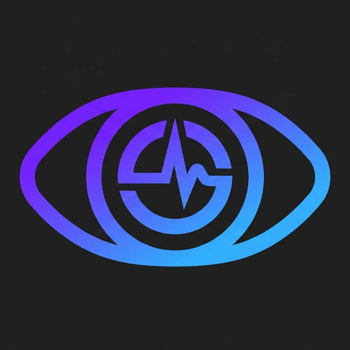
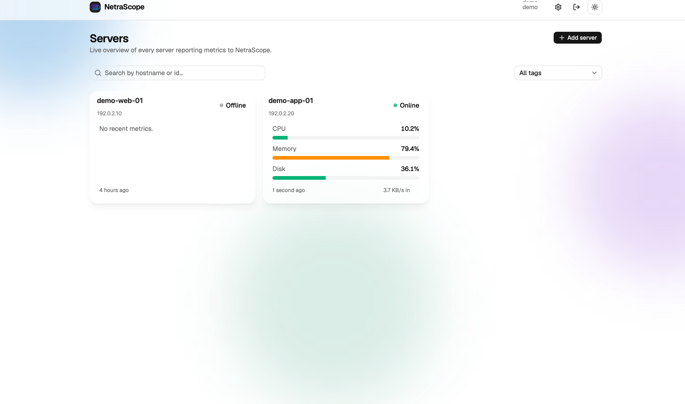

# NetraScope

<p align="center">
  
</p>

<p align="center">
  Self-hosted, open-source server monitoring with a lightweight cross-platform agent.
</p>

NetraScope collects CPU, memory, disk, and inbound network metrics from your
servers and presents them in a live web dashboard. It is designed for people
who want a small, understandable monitoring stack that they can run and modify
themselves.

> **Project status:** NetraScope is under active development. It is suitable
> for testing and personal deployments, but you should review its security,
> retention, backup, and availability settings before production use.

[**Open the live demo**](https://netra.eventhub.one)

The public demo is provided for evaluation and testing. Accounts and data may
be reset without notice, so do not submit production credentials, private
server details, or other sensitive information.



## Features

- Live fleet dashboard with online, stale, and offline status.
- CPU, memory, disk, and inbound network monitoring.
- Historical charts for 15-minute, 1-hour, 6-hour, and 24-hour windows.
- Search, server tags, and tag-based filtering.
- Owner-only server deletion with confirmation and metric-history cleanup.
- Per-user dashboards protected by JWT authentication.
- Per-user ingestion tokens for isolating agent data.
- Cross-platform Go agent for Linux, Windows, and macOS.
- Local SQLite buffering when the backend is unavailable.
- Automatic service installation and startup on supported operating systems.
- Light, dark, and system themes.
- Two backend choices:
  - ASP.NET Core with PostgreSQL for conventional or Docker hosting.
  - Cloudflare Workers with D1 or Supabase for serverless hosting.

## Architecture

```text
Monitored server
  NetraScope Go agent
        |
        | HTTPS + ingestion token
        v
  Backend API
    - ASP.NET Core + PostgreSQL
    - Cloudflare Worker + D1/Supabase
        |
        | authenticated REST API
        v
  React dashboard
```

The agent gathers metrics every 10 seconds by default. If delivery fails, it
stores packets in a local SQLite database and replays them in order when the
backend becomes reachable again.

## Quick Start With Docker

### Requirements

- Docker with Compose v2.
- Go 1.25 or newer if you want the deployment script to build agent binaries.

Clone the repository and start the complete PostgreSQL, backend, frontend, and
reverse-proxy stack:

```sh
git clone https://github.com/stonehappi/NetraScope.git
cd NetraScope
./deploy/deploy.sh
```

On Windows PowerShell:

```powershell
git clone https://github.com/stonehappi/NetraScope.git
cd NetraScope
.\deploy\deploy.ps1
```

The script creates local environment files from the included examples, builds
the agent for all supported platforms, and starts the stack. Open
`http://localhost:8081`, register an account, and copy the ingestion token from
the Settings page.

If Go is not installed, start the stack without rebuilding agent binaries:

```sh
./deploy/deploy.sh --skip-agent
```

Before exposing NetraScope publicly, replace the development database password
and JWT secret in `.env`.

## Connect A Server

Download the agent for the server's operating system from the latest GitHub
Release, or build it locally, place it at a permanent path, and test it in the
foreground:

```sh
./netrascope-agent \
  -server-url https://monitor.example.com/api/metrics \
  -token YOUR_INGESTION_TOKEN
```

Then install it as an automatically started background service:

```sh
sudo ./netrascope-agent \
  -service install \
  -server-url https://monitor.example.com/api/metrics \
  -token YOUR_INGESTION_TOKEN
```

Windows PowerShell must be run as Administrator:

```powershell
.\netrascope-agent.exe `
  -service install `
  -server-url https://monitor.example.com/api/metrics `
  -token YOUR_INGESTION_TOKEN
```

The same binary supports `status`, `start`, `stop`, `restart`, and `uninstall`
service actions. It also supports `-version` and `-update` for release-based
agent maintenance. See the [agent guide](agent/README.md) for all flags,
environment variables, build commands, and troubleshooting steps.

## Development

### Backend

The conventional backend requires .NET 10 and PostgreSQL:

```sh
export ConnectionStrings__NetraScope='Host=localhost;Port=5432;Database=netrascope;Username=postgres;Password=password'
export Auth__Jwt__Secret='replace-with-a-random-secret-at-least-32-characters'
export AllowedHosts='http://localhost:5173'

dotnet tool restore
dotnet ef database update \
  --project backend/src/NetraScope.Core \
  --startup-project backend/src/NetraScope.Core
dotnet run --project backend/src/NetraScope.Core --urls http://localhost:5050
```

### Frontend

In another terminal:

```sh
cd frontend
npm install
cp .env.example .env
npm run dev
```

The dashboard is available at `http://localhost:5173`.

### Agent

```sh
cd agent
go mod download
go run ./cmd/netrascope-agent \
  -server-url http://localhost:5050/api/metrics \
  -token YOUR_INGESTION_TOKEN
```

### Cloudflare Worker Backend

The Worker backend implements the same API as the .NET backend. It supports
Cloudflare D1 and Supabase:

```sh
cd worker-backend
npm install
cp .dev.vars.d1.example .dev.vars
npm run migrate:d1:local
npm run dev:d1
```

See the [Worker deployment guide](worker-backend/README.md) for D1, Supabase,
secrets, migrations, and production deployment.

## Testing

Run the backend and agent tests and validate both TypeScript projects:

```sh
dotnet test NetraScope.slnx

cd agent && go test ./...
cd ../frontend && npm run lint && npm run build
cd ../worker-backend && npm run check
```

## Repository Layout

| Path | Purpose |
| --- | --- |
| `agent/` | Go metric collector and cross-platform service manager |
| `backend/` | ASP.NET Core API, PostgreSQL entities, migrations, and tests |
| `frontend/` | React, TypeScript, Vite, Tailwind CSS, and shadcn/ui dashboard |
| `worker-backend/` | Cloudflare Worker API with D1 and Supabase adapters |
| `deploy/` | Cross-platform full-stack deployment scripts |
| `proxy/` | Nginx reverse-proxy configuration |
| `docker-compose.yml` | Local and self-hosted application stack |

## Security And Operations

- Use HTTPS for every production dashboard and ingestion endpoint.
- Replace all example passwords and JWT secrets before deployment.
- Keep ingestion tokens private. Regenerate a token from Settings if it is
  exposed.
- Restrict account registration if your deployment should not be public.
  Registration is currently open by default.
- Configure database backups and monitor disk growth.
- Define a retention or aggregation policy. At the default 10-second interval,
  each monitored server produces 8,640 metric rows per day.
- Treat the built-in CPU threshold as a starting point. It currently logs a
  critical event rather than sending external notifications.

Please report vulnerabilities privately according to the
[security policy](SECURITY.md) instead of opening a public issue.

## Contributing

Contributions are welcome. Before opening a pull request:

1. Open an issue for substantial changes so the approach can be discussed.
2. Keep changes focused and follow the conventions of the component you edit.
3. Add or update tests for behavior changes.
4. Run the relevant commands from the [Testing](#testing) section.
5. Do not commit secrets, local databases, generated build output, or
   environment files.

Useful places to contribute include alert integrations, metric retention,
additional host metrics, deployment documentation, accessibility, and test
coverage.

## Developer

NetraScope is created and maintained by **Seng Vannak**, a software developer,
lecturer, and researcher based in Phnom Penh, Cambodia. He works across web
and mobile development, database design, system architecture, and applied
research.

- GitHub: [@stonehappi](https://github.com/stonehappi)
- Email: [vannakseng1996@gmail.com](mailto:vannakseng1996@gmail.com)
- Telegram: [@VannakStone](https://t.me/VannakStone)
- LinkedIn: [Vannak Seng](https://www.linkedin.com/in/vannak-seng-072693109)
- ORCID: [0009-0004-8130-8476](https://orcid.org/0009-0004-8130-8476)
- Affiliation: Faculty of Engineering, Royal University of Phnom Penh

## Documentation

- [Dashboard development](frontend/README.md)
- [.NET backend](backend/README.md)
- [Agent usage](agent/docs/USAGE.md)
- [Agent release builds](agent/docs/BUILD.md)
- [Docker deployment](deploy/README.md)
- [Cloudflare Worker backend](worker-backend/README.md)

### Production deployment guides

- [Backend on IIS](backend/deploy/deploy.iis.md)
- [Frontend with nginx](frontend/deploy/deploy.nginx.md)
- [Worker backend on Cloudflare D1](worker-backend/deploy.d1.md)

## License

NetraScope is released under the [MIT License](LICENSE).

Third-party dependencies and bundled assets remain subject to their respective
licenses, including the SIL Open Font License for the Geist font.
